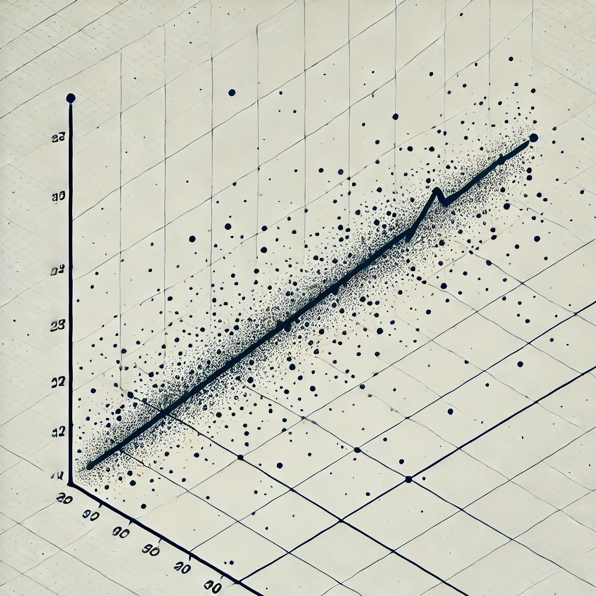
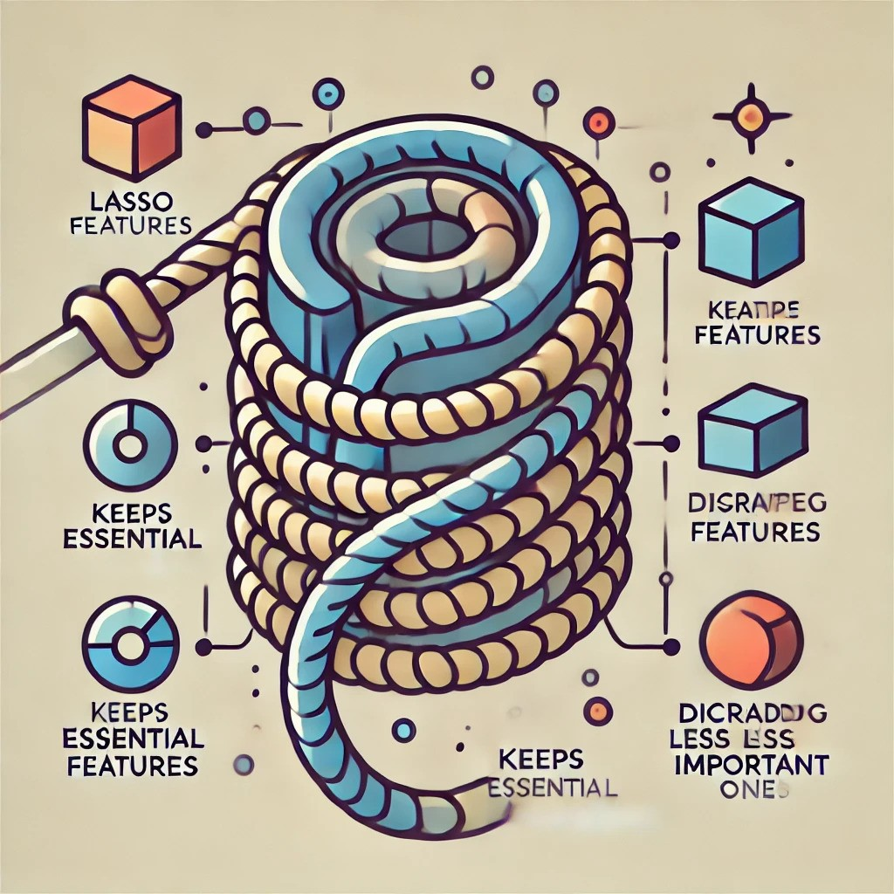

This website contains tutorials and exercise sets on various topics to help you
learn and apply concepts introduced in the course. Explore the topics and start learning!

## Regression models

::: {.grid}

::: {.g-col-4}

  
  <a href="multiple_regression/multiple_regression.qmd">Linear regression</a>

  
  <a href="multiple_regression/multiple_regression.qmd">Multiple regression</a>

:::

::: {.g-col-4}

  
  <a href="multiple_regression/multiple_regression.qmd">KNN regression</a>

  
  <a href="multiple_regression/multiple_regression.qmd">LASSO regression</a>

:::

::: {.g-col-4}

  
  <a href="multiple_regression/multiple_regression.qmd">Ridge regression</a>

  
  <a href="multiple_regression/multiple_regression.qmd">Tree regression</a>

:::

:::

