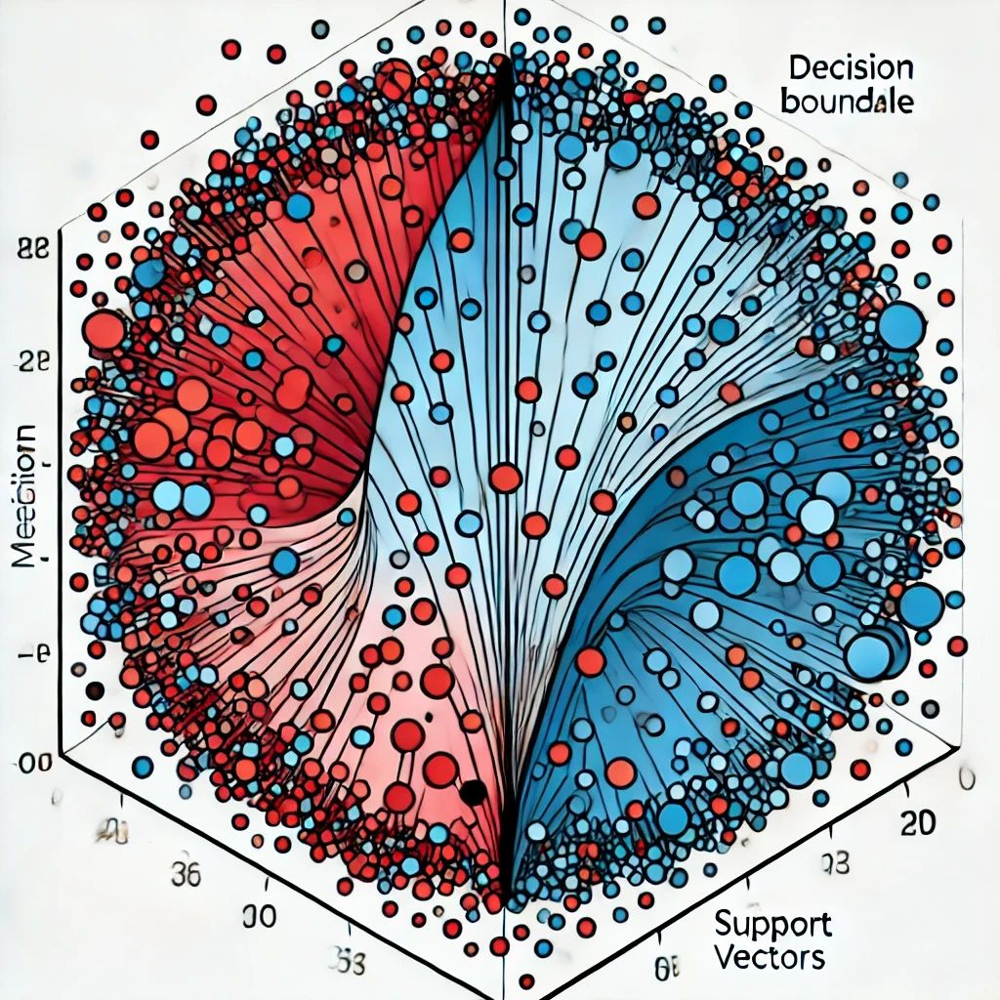

This website contains tutorials and exercise sets on various topics to help you
learn and apply concepts introduced in the course. Explore the topics and start learning!

## Regression models

::: {.grid}

::: {.g-col-4}

  
  <a href="multiple_regression/multiple_regression.qmd">Linear regression</a>
  <a href="multiple_regression/multiple_regression_exercise_set.qmd">Exercise set</a>

  
  <a href="multiple_regression/multiple_regression.qmd">Multiple regression</a>
  <a href="multiple_regression/multiple_regression_exercise_set.qmd">Exercise set</a>

:::

::: {.g-col-4}

  
  <a href="knn_regression/knn_regression.qmd">KNN regression</a>
  <a href="knn_regression/knn_regression_exercise_set.qmd">Exercise set</a>

  
  <a href="lasso_regression/lasso_regression.qmd">LASSO regression</a>
  <a href="lasso_regression/lasso_regression_practice.qmd">Exercise set</a>

:::

::: {.g-col-4}

  
  <a href="ridge_regression/ridge_regression.qmd">Ridge regression</a>
  <a href="ridge_regression/ridge_regression_practice.qmd">Exercise set</a>

  
  <a href="tree_regression/tree_regression.qmd">Tree regression</a>
  <a href="tree_regression/tree_regression_practice.qmd">Exercise set</a>

:::

:::

## Classification models

::: {.grid}

::: {.g-col-4}

  
  <a href="logistic_regression/logistic_regression.qmd">Logistic regression</a>
  <a >Exercise set</a>

  
  <a href="tree_regression/tree_regression.qmd">Tree classification</a>
  <a >Exercise set</a>

:::

::: {.g-col-4}

  
  <a href="knn_classification/knn_classification">KNN classification</a>
  <a >Exercise set</a>

:::

::: {.g-col-4}

  
  <a href="svm_classification/svm_classification.qmd">SVM classification</a>
  <a href="svm_classification/svm_classification_exercise_set.qmd">Exercise set</a>

:::

:::